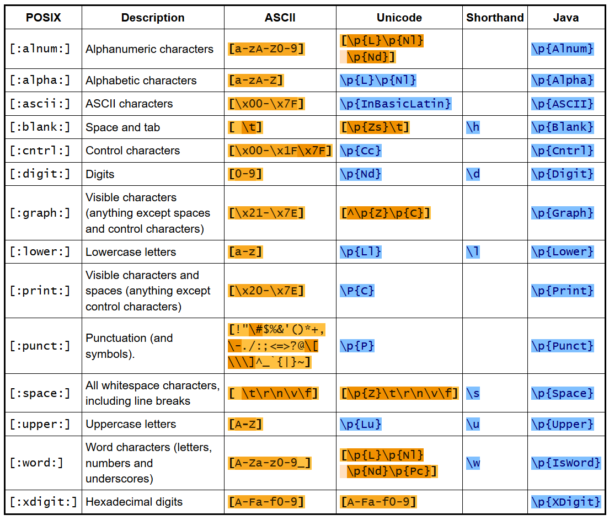

## POSIX bracket expressions

besides literal characters such as z, ;, and so on, you can have additional components. These are:

 * *Character classes*
	A POSIX character class consists consists of keywords bracketed by [: and :]. The keywords describe different classes of characters such as alphabetic characters, control characters, and so on.

 * *Collating symbols*
	A collating symbol is a multicharacter sequence that should be treated as a unit. It consists of the characters bracket by [. and .]. Collating symbols are specific to the locale in which they are used.

 * *Equivalence classes*
	An equivalence class lists a set of characters that should be considered equivalent, such as e and é. It consists of named element from the locale, bracketed by [= and =].

All three og these constructs **must** appear inside the square brackets of a bracket expression.

### Some example

**[[:alpha:]!]** matches any single alphabetic character or exclamation mark

**[[.ch.]]** matches the collating element *ch*, but does not match just the letter *c* or the letter *h*.

In French locale, \[\[=e=]] might match any of e, é, è, ê or ë.

[[what_is_regular_expression?.md]]
