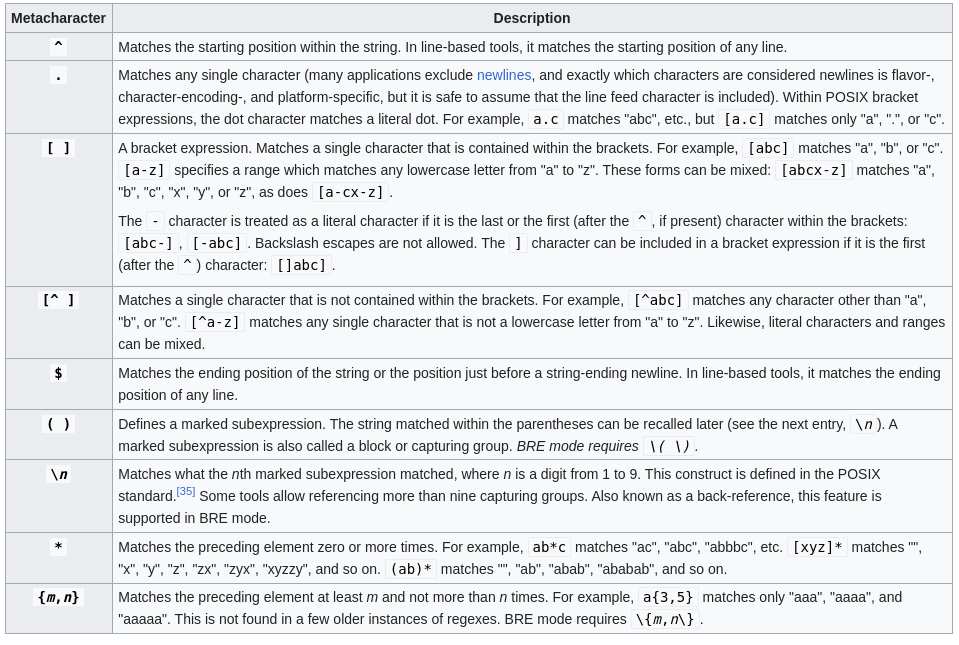
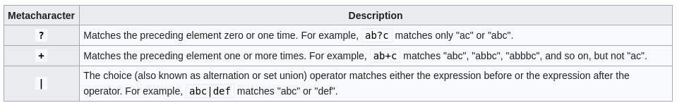

## What is a regular expression?

Regular expressions are a notation that lets you search for text that fits a particular criterion, such as "start with the letter a." The notation lets you write a single expression that can select, or *match*, multiple data strings.

### POSIX regular expresion let you

Above and beyond traditional Unix regular expression notation:
 
 * Write regular expressions that express locale-specific character sequence ordering and equivalences.

 * Write your regular expresions in a way that does not depend upon the underlying character set of the system.

### A large number of Unix utilities derive their power from regular expression of one form or another

A partial list includes the following:

 * The *grep* family of tools for finding matching lines of text: *grep* and *egrep* and as well the nonstandard but useful *agrep*

 * The *sed* stream editor, for making changes to an input stream, described later...

 * String processing languages, such as *awk*, *Icon*, *Perl*, *Python*, *Ruby*, *Tcl* and others.

 * File viewers (sometimes called pagers), such as *more*, *page*, and *pg*, which are common on commercial Unix system, and other popular *less* pager.

 * Text editors, such as the venerable *ed* line editor, the standard *vi* editor, and popular add-on editors such as *emacs*, *jed*, *jove*, *vile*, *vim*, and others

### How are build regular expressions

Regular expressions are built from two basic components:

 * *ordinary character* - is any character that isn't special, as defined in the following table. In some contexts even *special* characters are treated as ordinary characters.

 * *special characters* - also called *metacharacters* a term that we use the in this chapter...

### Tables of POSIX BRE ERE metacharacters

### Simple Regular Expression matching examples

| Expressions	  | Matches											| 
|-----------------|:-----------------------------------------------:|
| **tolstoy**     | The seven letters *tolstoy*, anywhere on a line |
| **^tolstoy**    | The seven letters *tolstoy*, at the beginning of the line |
| **tolstoy$**    | The seven letters *tolstoy*, at the end of the line |
| **^tolstoy$**	  | A line containing exactly the seven letters *tolstoy*, and nothing else |
| **[Tt]olstoy**  | Either the seven letters *Tolstoy*, ot the seven letters *tolstoy*, anywhere on the line |
| **tol.toy**	  | The three letters *tol*, any character, and the three letters *toy*, anywhere on the line |
| **tol.\*toy**   | The three letters *tol*, any sequence of zero or more characters, and the three letters *toy* anywhere on the line |

[[regular_expressions]]
