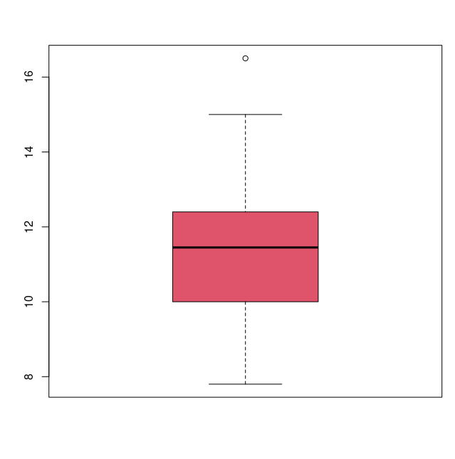

## Mediadas de posicion y dispersion

### Principales medidas de dispersion y posicion:

 * **media** - es obtenida con la funcion *mean*

 * **mediana** - cuyo valor obtenemos con la funcion *median*

 * **cuasivarianza** - se obtiene con la funcion *var*

 * **cuasivarianza tipica** - con la funcion *sd*

 * **quantiles** - con la funcion *quantile*

Un buen resume de muchas de las medidas de posicion se obtiene de una vez con la funcion *summary*


### Diagrama de Cajas

Un Grafico #representaciones_graficas_R con el que podemos visualizar la dispersion y simetria de los datos, muy utilizado para analizar suposiciones requeridas por el Analisis de la *Varianza*, es el *Diagrama de cajas*, la cual se ejecuta con la funcion **R boxplot**.

	* consiste en representar una caja en donde el lado inferior sea el primer cuartil, el superior el tercer cuartil, apareciendo dividida por la mediana de los datos.
	* Se añaden dos segemetos a la caja adi formada para unitla al maximo y minimo valor.
	* Aquellos datos inferriores al primer cuartil menos 1.5 veces el recorrido intercuartilico, o superiormente al tercer cuartil mas 1.5 veces el recorrido intercuartilico se consideran anomalos, se representan por pequeños circulos.

### Ejemplo

```R
> x1<-c(10.6,12.5,11.1,9.2,11.5,9.9,11.9,11.6,14.9,12.5,12.5,12.3,
+ 12.2,10.,16.5,15,10.3,12.4,9.1,7.8,11.3,12.3,9.7,12,11.8,12.7,                         
+ 11.4,9.3,8.6,8.5,10.1,12.4,11.1,10.2)
> mean(x1)
[1] 11.32941
> median(x1)
[1] 11.45
> quantile(x1)
    0%    25%    50%    75%   100% 
 7.800 10.025 11.450 12.375 16.500 
> quantile(x1,probs=0.25)
   25% 
10.025 
> var(x1)
[1] 3.559715
> sd(x1)
[1] 1.886721
> summary(x1)
   Min. 1st Qu.  Median    Mean 3rd Qu.    Max. 
   7.80   10.03   11.45   11.33   12.38   16.50 
> boxplot(x1,col=2)
```




#mediadas_posicion_y_dispersion
