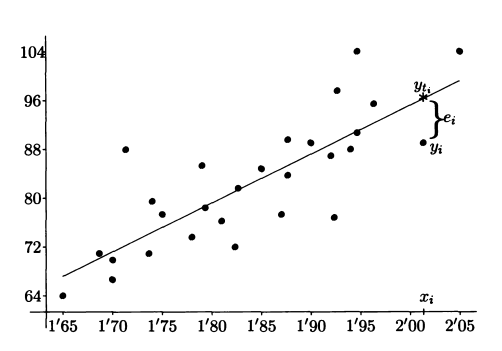

## Ajsutes por minimos cuadrados

### La dependencia de las variables y la no funcionalidad de estas.

Es un pensamiento comun, la mayoria de las veces expresado de forma imprecisa, que el Peso y la Talla de los indidivuos de una poblacion no son *independientes*, sino que por el contario, parece existir una determinada relacion entre ellos, de forma que cuando mayor sea la talla se un individuo, mayor sera su peso. 


Tambien suele afirmarse que esta relacion no es *funcional* en el sentido de que no se puede determinar una formula exacta que nos de el Peso de un individuo en *funcion* de su talla, sino que existen unos determinador valores entre los que razonablemente deberia estar el peso.

### Explicacion de los ajustes por minimos cuadrados

Al tener una nube de puntos donde vemos la representada la talla y el peso, si pudieramos determinar una recta proxima a la nube de puntos $$y_ti = \beta_0 + \beta_1 x_i $$ la talla $y_i$ de un individuo deberia estar alrededor del valor que nos de la recta $y_ti$ para un peso $x_i$ como el suyo.

Este es el objetivo de la presente seccion: determinar la ecuacion de una recta $y_ti = \beta_0 + \beta_1 x_i$ , lo mas proxima posible a una nube de puntos $(x_1,y_1),...,(x_n,y_n)$ en el sentido de *minimos cuadrados* es decir:

 * determinar los valores $\beta_0$ $\beta_1$ que hagan minima la suma de los cuadrados de las desviaciones $e_i$ entre los valore observados $y_i$ y los teoricos dados por la recta $y_ti$

$$\sum_{i=1}^{n} x²_i = \sum_{i=1}^{n} (y_i - y_ti)² = \sum_{i=1}^{n} (y_i - \beta_0 - \beta_1 x_i)²$$



### Explicacion matematica

Matematicamente este problema se resuelve considerando la ecuacion anterior como una funcion de $\beta_0$, derivando respecto a $\beta_0$ e igualando a cero dicha ecuacion. A continuacion, se considera la ecuacion de la suma de los cuadrados como una funcion de $\beta_1$, se deriva respecto a $\beta_1$ y se iguala a cero esta ecuacion. Se obtiene asi un sistema de dos ecuaciones con dos incognitas de donde despejamos y obtenemos los valores para $\beta_1$ y $\beta_0$,

$$\beta_1 = \frac{n \sum_{i=1}^{n} x_i y_i - (\sum_{i=1}^{n} x_i)(\sum_{i=1}^{n} y_i)}{n \sum_{i=1}^{n} x²_i - (\sum_{i=1}^{n} x_i)²}$$
y

$$\beta_0 = \frac{\sum_{i=1}^{n} y_i - \beta_1 \sum_{i=1}^{n} x_i}{n}$$


### Ejemplo en R

Tenemos los datos de talla y peso de 30 individuos y vamos calcular la ecuacion de la recta y hacer su grafica:

```R
> peso <- c(70, 63, 78, 55, 72, 68, 80, 61, 71, 65, 75, 58, 69, 73, 66, 79, 56, 74, 67, 81, 62, 76, 64, 77, 59, 70, 63, 78, 55, 72)
> talla <- c(175, 168, 182, 160, 178, 172, 185, 167, 176, 170, 180, 165, 174, 177, 169, 183, 162, 179, 173, 186, 168, 177, 166, 178, 161, 175, 168, 182, 160, 178)
> plot(talla, peso, main = "Grafico de Dispersion", xlab = "Talla (cm)", ylab = "Peso (kg)")
```


### La recta de ajuste: $$y = (-107.555) + 1.017 x$$

si substituimos x por la talla en cm de algun individuo la ecucion nos deberia predecir el peso de nuestro individuo $$y = (-107.555) + 1.017 * 178 = 73.47599999999998$$

y siendo el peso en kg.

```R
> ajuste <- lm(peso ~ talla)
> ajuste

Call:
lm(formula = peso ~ talla)

Coefficients:
(Intercept)        talla  
   -107.555        1.017  

> abline(ajuste, col = "red")
```


### Leyenda

```R
> legend("topleft", legend = "ajuste lineal", col = "red", lty = 1)
```


#representaciones_graficas_R
