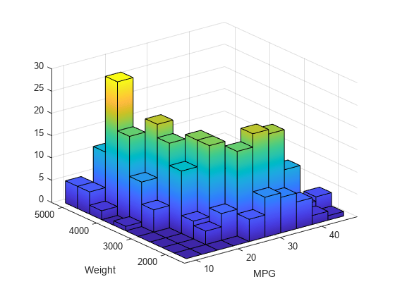
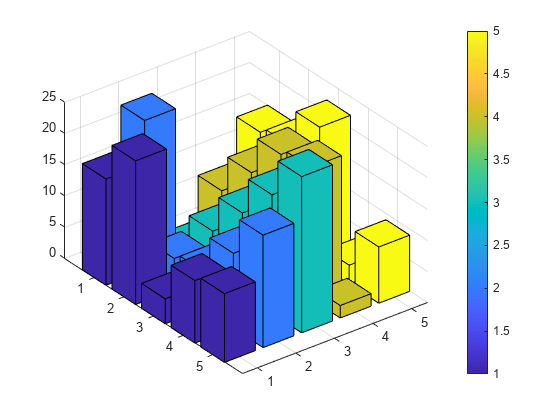
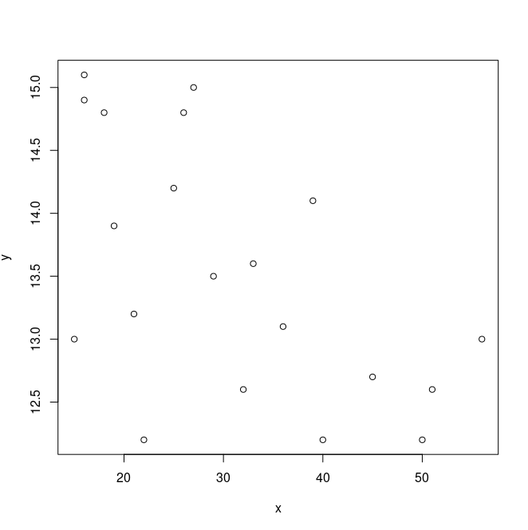
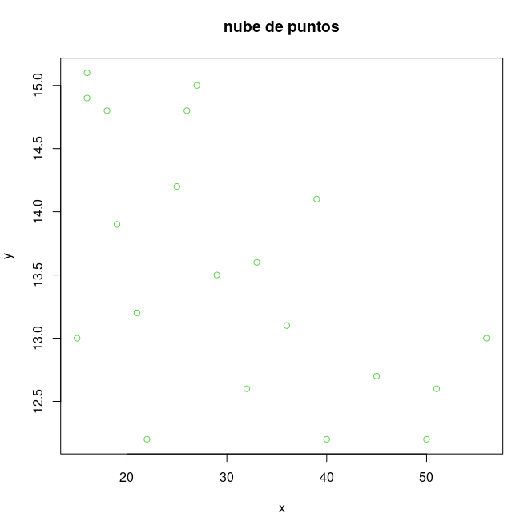
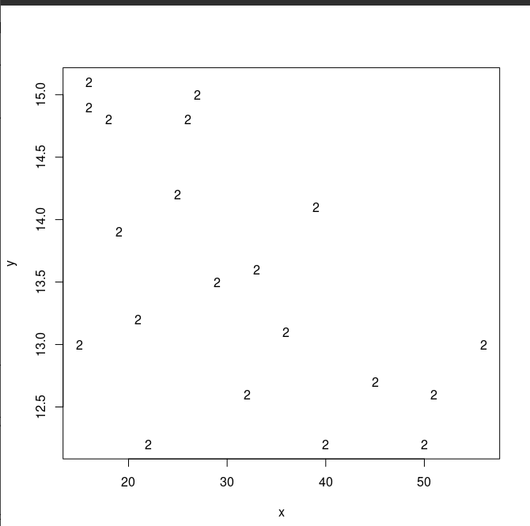
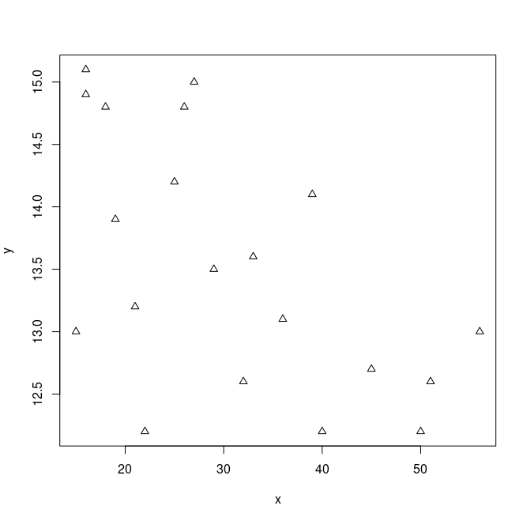
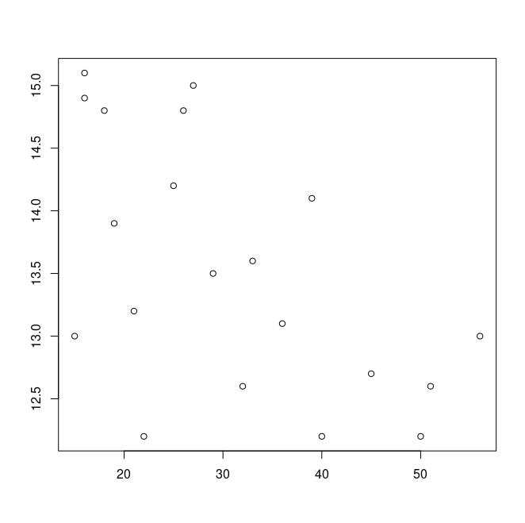
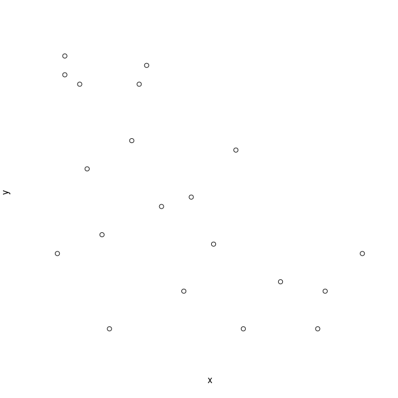

iiiRepresentaciones graficas de las distribuciones de frecuencias bidimensionales

Las distribuciones bidimensionales solo consideramos representaciones graficas en el caso de que ambos caracteres sean cuantitativos:

 * En el caso de que vengan agrupados en intervalos

 * En el caso de que ambos tomen valores aislados

### Datos agrupados en intervalos correspondientes a un caracter cuantitativo

La representacion habitiual de este tipo de datos es un *histograma tridimensional*, el cual se construye utilizando los mismos criterios que el histograma visto en distribuciones udimensionales.

 * Se utiliza un sistema de ejes de coordenadas en tres dimesiones, en donde los dis primeros ejes se reservan para las dos variables, representadose en altular la frecuencia, absoluta o relativa segun la distribucion que estemos representando.

 * Esto en el caso de que los intervalos de ambas variables tengan igual amplitud; si no, las alturas de los paralelepipedos deberan ser tales que su volumen resultante sea igual a la frecuencia.



### Datos sin agrupar correspondientes a un caracter cuantitativo

La representacion grafica, denominada *Diagrama de barras tridimensional*:

 * se have utilizando el sistema de ejes coordenadas en tres dimensiones, levantando en cada par de valores ($x_i, y_j$) de la varaible bidimensional (X, Y), una barra de altura igual a su frecuecia (absoluta o relativa).

 


### nube de puntos

Si no exiten pares de valores repetidos, suele utilizarse el denominado diagrama de dispersion o *nube de puntos*, el cual consiste en representar en un sistema de ejes de coordenadas de dos dimensiones tantos puntos como datos, asignado a cada dato ($x_i,y_j$) el punto de coordenadas ($x_i,y_j$).

 * Ejemplo:

	Tras preguntar a 20 personas con aficiones atelticas la marca que poseian en 100 metros lisos y las horas semanales que, por termino medio, dedicaban a entrenar e obtuvieron los siquientes datos

	x = siendo las horas medias por semana de entreno

	y = la marca de 100 metros lisos

```R
> x<-c(21,32,15,40,27,18,26,50,33,51,36,16,19,22,16,39,56,29,45,25)
> y<-c(13.2,12.6,13,12.2,15,14.8,14.8,12.2,13.6,12.6,13.1,14.9,13.9,12.2,15.1,14.1,13,13.5,12.7,14.2)
> plot(x,y)
```




### poner titulo y color a los puntos

```R
> plot(x,y,main="nube de puntos", col=3)
```



### Poner los puntos como un 2

```R
> plot(x,y,pch="2")
```



### Poner los puntos como el simbolo numero 2(triangulos), hay del o al 18

```R
> plot(x,y,pch=2)
```



### No poner nombre a los ejes

```R
> plot(x,y,xlab=" ",ylab=" ")
```



### No pone el marco al grafico

```R
> plot(x,y,axes=F)
```




#representaciones_graficas_R
