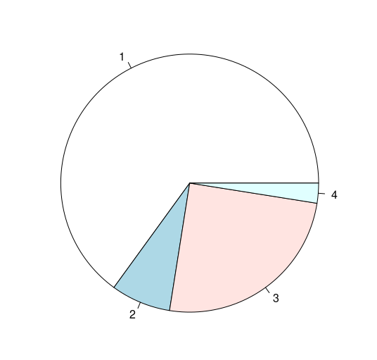
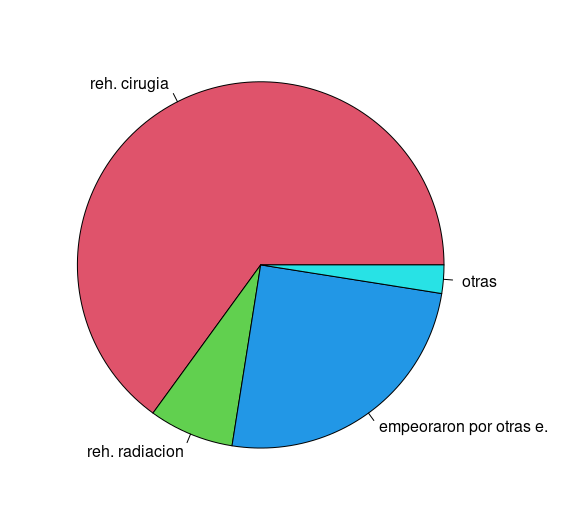
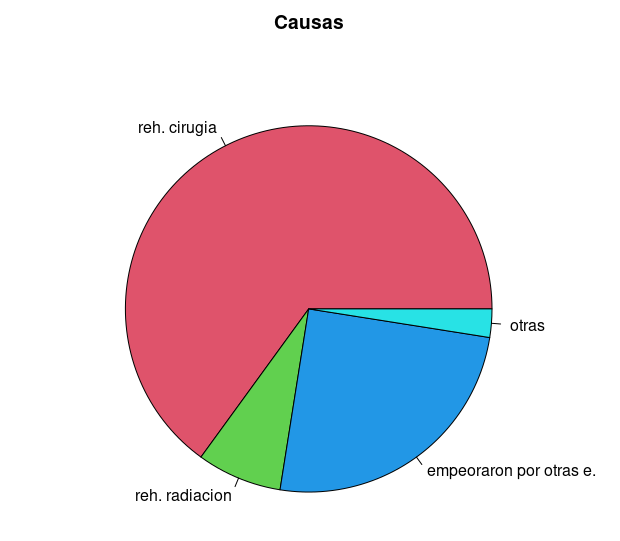
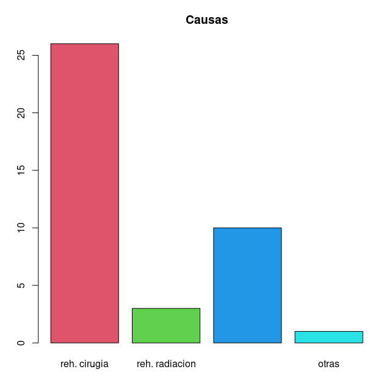
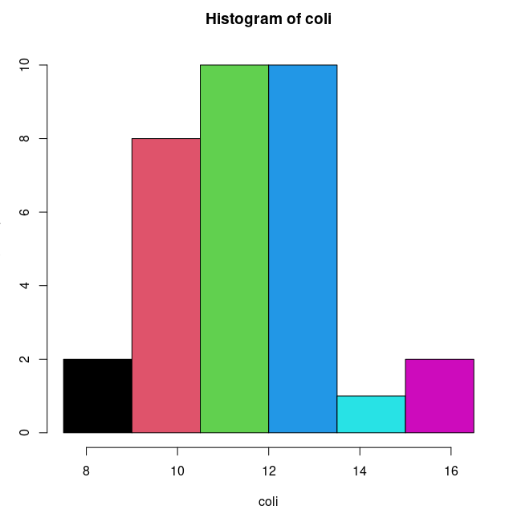
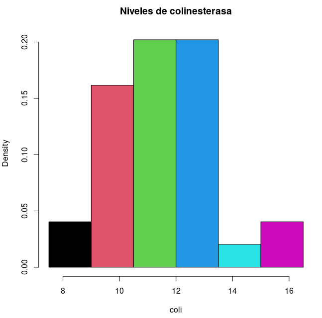
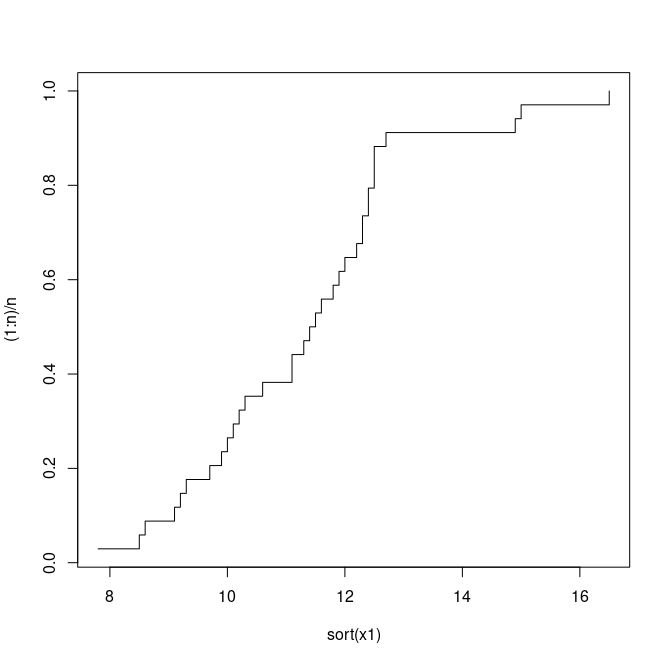
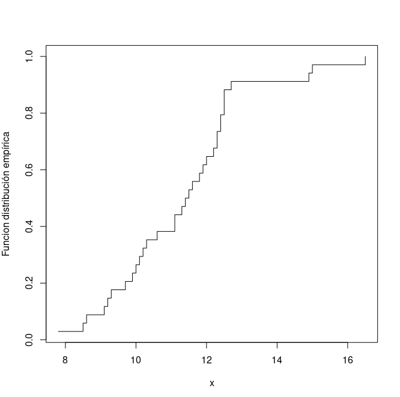

# Representaciones graficas de las distribuciones unidimensionales de frecuencia

La representacion grafica de una distribucion de frecuecia depende del tipo de datos que la constituya.

## Datos correspondientes a un caracter cualitativo

La representacaion grafica de este tipo de datos se basa en la proporcionalidad de las **areas** a la frecuencias absolutas o relativas.
Veremos dos tipos de representacion:
	* Diagrama de sectores 
	* Diagrama de Rectangulos

#### Diagrama de Sectores

Consiste en dividir el circulo en tantos sectores como modalidades haya en el caracter cualitativo, asignando un angulo central a cada sector circular proporcional a la frecuencia $n_i$, consiguiendo asi de esta manera un sector con area proporcional tambien a $n_i$

#### Ejemplo que utilizaremos:

	Rehusaron cirugia:								234
	Rehusaron radiacion:							27
	Empeoraron por una enfermedad ajena al cancer:	90
	Otras causas:									9

```R
> x2<-c(26,3,10,1)
> pie(x2)
```



Haciendolo de esta manera R elige colores arbritario, y denomina con simples numeros los sectores correspondientes  a las clases que representa la varaible cualitativa.
	
 * tendremos que crear un vector de caracteres y otro vector para los colores.

```R
> n2<-c("reh. cirugia","reh. radiacion","empeoraron por otras e.","otras")
> c2<-c(2,3,4,5)
> pie(x2,labels=n2,col=c2)
```



* si quisieramos ademas ponerle titulo al grafico.
 
```R
> pie(x2,labels=n2,col=c2,main="Causas")
```



#### Diagrama de Sectores

Consiste en contruir tantos Rectangulos como modalidades presente el caracter cualitativo en estudio, todos ellos con base de igual amplitud. La altura se toma igual a la frecuencia absoluta o relativa, consiguiendo de esta manera areas proporcionales a las frecuencias que se quieren representar.

```R
> barplot(x2,names=n2,col=c2,main="Causas")
```



## Datos correspondientes a un caracter cuantitativo agrupado en intervalos

La Representacion habitual es el **Histograma** en donde sobre cada intervalo se levanta un rectangulo con un area igual a la frecuencia, absoluta o relativa.

#### Ejemplo que utilizaremos

| $I_i$     | $n_i$ |
| --------- | ----- |
| 7,5 - 9   | 3     |
| 9 - 10,5  | 8     |
| 10,5 - 12 | 10    |
| 12 - 13,5 | 10    |
| 13,5 - 15 | 1     |
| 15 - 16,5 | 2     |
|           | 34    |


```R
> m1<-c(8.25,9.75,11.25,12.75,14.25,15.75)
> n1<-c(2,8,10,10,1,2)
> coli<-rep(m1,n1)
> d1<-(7.5,9,10.5,12,13.5,15,16.5)
> d1<-c(7.5,9,10.5,12,13.5,15,16.5)
> c1<-(1,2,3,4,5,6)
> c1<-c(1,2,3,4,5,6)
> hist(coli,breaks=d1,col=c1)
```



De esta manera, el area del histograma no sumara 1 como habitualmente deseamos. Para conseguir esto, debemos de utilizar el argumento **prob=T** 

```R
> hist(coli,breaks=d1,col=c1,main="Niveles de colinesterasa",prob=T)
```




## Datos correspondientes a un caracter cuantitativo sin agrupar en intervalos

Esta es la situacion habitual que tendremos para un conjunto de datos cuantitativos.
	
	* Si son pocos los valores distintos de la varaible **diagrama de barras**
	* Si hay muchos valores distintos **histograma** o **Diagrama de hojas y ramas**

En el caso de frcuencias acumuladas la representacion grafia sera el **Diagrama de Frecuencias acumuladas** denominado *Funcion de ditribucion empirica* si las frecuencias aculumadas a representar son las relativas.

#### Ejemplo Diagrama de barras

```R
> x3<-c(5,6,8,4,2)
> n3<-c(0,1,2,3,4)
> barplot(x3,names=n3,main="Numero de Hijos")
```

Si queremos hacer un histagrama de ellos, dejando que el ordenador elija los puntos de corte.

```R
> x1<-c(10.6,12.5,11.1,9.2,11.5,9.9,11.9,11.6,14.9,12.5,12.5,12.3,
+ 12.2,10.,16.5,15,10.3,12.4,9.1,7.8,11.3,12.3,9.7,12,11.8,12.7,
+ 11.4,9.3,8.6,8.5,10.1,12.4,11.1,10.2)
> hist(x1)
```

Si queremos controlar los intervalos del Histograma utilizariamos el argumento **breaks** con un vector de puntos de corte. 
Si queremos simplemente fijar **n** de intervalos, pondriamos **breaks=n**.

#### Ejemplo Diagrama de hojas y ramas

Se ejecuta con la funcion **stem**.

```R
> stem(x1)

  The decimal point is at the |

   7 | 8
   8 | 56
   9 | 12379
  10 | 012368
  11 | 11345689
  12 | 0233445557
  13 | 
  14 | 9
  15 | 0
  16 | 5
```

Como podemos observar, si empezamos a leer el grafico por arriba, vemos que las observaciones son, 7,8 , 8,5 ,...,16,5.

#### Funcion de Distribucion empirica

Se obtiene con la siguiente combinacion de funciones:
	* primero creamos un vector igual al numero de datos
	* despues pedimos que represente los pares de datos **(sort(x1),(1:n)/n)**. 
		* **sort** es la funcion que ordena los datos.
		* **(1:n)/n** es la ristra de valores de 1 a **n**, divididos por **n**.
		* El valor **s** del argumento **type** se utiliza para que no haga un grafico de puntos sino de segmentos.

```R
> n<-length(x1)
> plot(sort(x1),(1:n)/n,type="s")
```



Si queremos que no aparezca el eje de absicisas **sort(x1)** sino la variable, digamos **x**, y qye el eje de ordenadas del grafico aparezca un rotulo.

```R
> plot(sort(x1),(1:n)/n,type="s",xlab="x",ylab="Funcion distribución empírica")
```



Estos dos argumentos xlab y ylab son tambien comunes a todas las funciones graficas de R.

#representaciones_graficas_R
