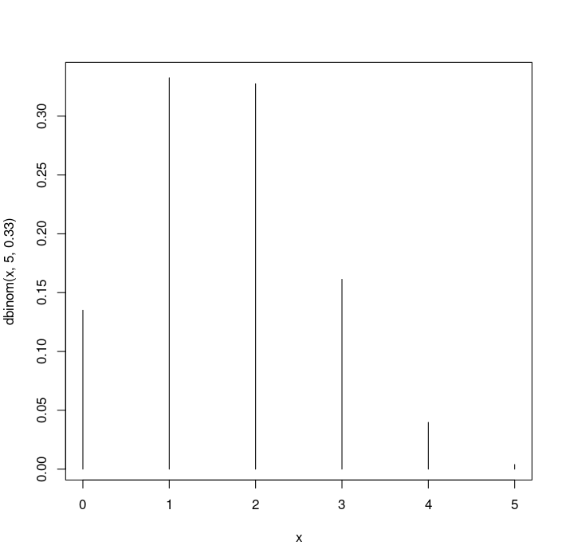
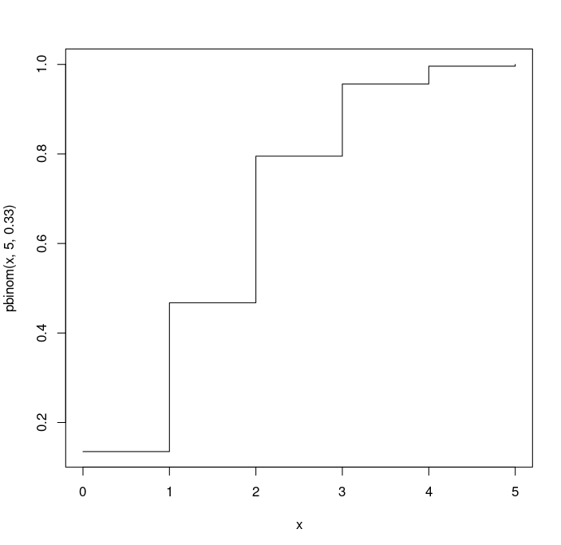

## Distribucion Binomial

Esta distribucion modeliza el *numero de exitos* en experimentos denominados, de forma generica, *Pruebas de Bernoulli*. 

### Pruebas de Bernoulli

Estas pruebas consisten en la realizacion de ensayos repetidos e independientes, existiendo en cada ensayo solamente dos resultados posibles -- denominados de forma generica *exito* y *fracaso* -- y manteniendo constante la probailidad de existo a largo de los enayos.

### ejemplo de pruebas de Bernoulli 

Si se esta etudiando el Sexo en el nacimento, se pude denominar *exito* a nacer **mujer** y *fracaso* a nacer **hombre**. Cada nacimiento puede modelizarse como una Prueba de Bernoulli y el numero de hembras en un grupo determinado en bebes recien nacidos sera la variable a modelizar con una *Distribucion Binomial*

### explicacion matematica

Si el nuemro de pruebas de Bernoulli que se realizan en n (n nacimentos) y la probabilidad de *exito* en cada un de ellas es p (probabilidad de nacer hembra), la variable de interes X es el *numero de existos en las n pruebas*, siendo la funcion de masa de esta distribucion, $$PX(x) = P\{X=x\} = {(n x)p^x(1 -p)^{n-x}}$$		,	$$x = 0,1,...,n$$ en donde deben ser ${n >= 1}$ y 0 < p < 1. En este caso diremos que X sique una distribucion (o tiene un modelo) binomial de parametros *n y p* y lo representaremos por $X ~>B(n,p)$
	Su medida y su variaza son respectivamente,
$$E[X] =np$$ , $$V(X)=np(1-p)$$

.
.
.

### Calculo de probabilidad Binomial con R

	* Para calcular probabilidades binomiales con R, debemos utilizar el comando **binom**.

```R
> pbinom(x,n,p)		# valor de la funcion de distribucion en x de la binomial (n,p)
> dbinom(x,n,p)		# valor de la funcion de masa en x de la binomial(n,p)
> qbinom(q,n,p)		# cuantil de orden q de la binomial (n,p)
> rbinom(m,n,p)		# muestra aleatoria de tamaño m de la binomial (n,p)
```

Estas funciones tambein nos permiten dibujar las funciones de masa o distribucion

#### ejemplo distribucion de funcion de	masas y distribucion

si queremos representar la funcion de masa de una distribucion binomial $B(5,0.33)$ ejecutariamos lo siquiente:
		* en el argumento **type** de la funcion **plot** hemos utlizado la opcion **h** para obtener un grafico del tipo *histograma*

```R
> x<-seq(0,5,len=6)
> plot(x,dbinom(x,5,0.33),type="h")
```



Si queremos representar la funcion de la distribucion de la B(5,0.33) ejecutariamos lo siguiente:
		* utilizaremos la opcion **s** para la representacion de la funcion de distribucion

```R
> x<-seq(0,5,len=6)
> plot(x,pbinom(x,5,0.33),type="s")
```


