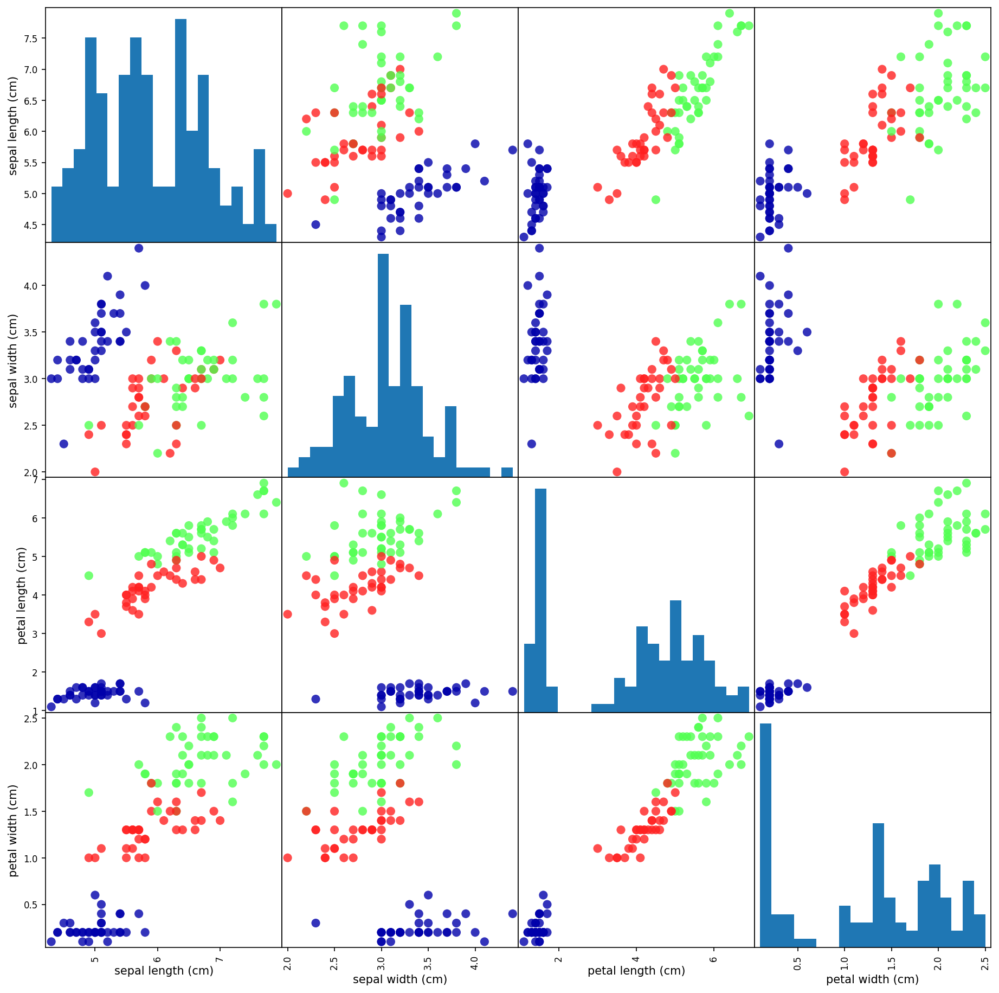

# First thing First: Look at your data

- Before building a machine learning model it is often good idea to inspect the data, to see if the task is easily solvable without machine learning, or if the desired information might not be contained in the data.

- Additionally, inspecting your data is a good way to find abnormalities and peculiarities. Maybe some of your itises were measured using inches and not centimeters...

## best way to inspect data

- the best way to inspect data is visualize it. One way to do this is by using a *scatter plot*. --> scatter plot puts one feature along the x-axis and another along the y-axis, and draws a dot for each data points.

### example

- the next plot is a pair plot of the features in the trainning set. The data points are colored according to the species the iris belongs to. To create the plot, we first convert the **Numpy** array into a **pandas DataFrame**. **pandas** has a function to create pair plots called *scatter_matrix*.

The diagonal of this matrix is filled with histograms of each feature:

```python
# create dataframe from data in x_train
# label the colums using the strings in iris_dataset.feature_names
iris_dataframe = pd.DataFrame(X_train, columns=iris_dataset.feature_names)
# create a scatter matrix from the dataframe, color by y_train
pd.plotting.scatter_matrix(iris_dataframe, c=y_train, figsize=(115, 15),
                           marker='o', hist_kwds={'bins': 20}, s=60,
                           alpha=.8, cmap=mglearn.cm3)
```

[out]



#first_exercice
