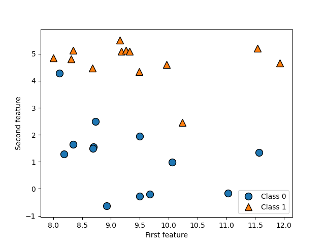
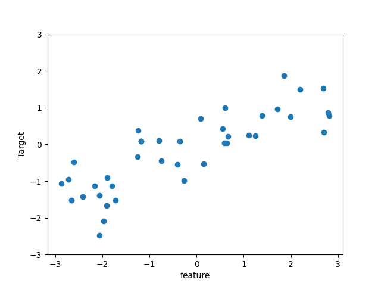

# Some Sample Datasets

- We will use several datasets to illustrate the different algorithms. Some of the datasets will be small and synthetic (meaning made-up), designed to highlight particular aspects of the algorithms. Other datasets will be large, real-world examples.

- An example of a synthetic two-class classification dataset is the forge dataset, which has two features. The following code creates a scatter plot visualizing all of the data points in this dataset. The plot has the first feature on the x-axis and the second feature on the y-axis. As is always the case in scatter plots, each data point is represented as one dot. The color and shape of the dot indicates its class

```python

# generate dataset

X, y = mglearn.datasets.make_forge()

# plot dataset

mglearn.discrete_scatter(X[:, 0], X[:, 1], y)
plt.legend(["Class 0", "Class 1"], loc=4)
plt.xlabel("First feature")
plt.ylabel("Second feature")
print("X.shape", X.shape)

plt.savefig("forge_plot.png")
plt.close()

```

[out]

```sh
X.shape: (26, 2)
```




- As you can see from X.shape, this dataset consists of 26 data points, with 2 features.

- To illustrate regression algorithms, we will use the synthetic **wave dataset**.The wave dataset has a single input feature and a continuous target variable (or response) that we want to model. The plot created here shows the single feature on the X-axis and the regression target (the output) on the y-axis:

```python

X, y = mglearn.datasets.make_wave(n_samples=40)
plt.plot(X, y, 'o')
plt.ylim(-3, 3)
plt.xlabel("feature")
plt.ylabel("Target")

plt.savefig("wave_plot.png")
plt.close()
```



- We are using these very simple, low-dimensional datasets because we can easily visualize them—a printed page has two dimensions, so data with more than two features is hard to show. Any intuition derived from datasets with few features (also called low-dimensional datasets) might not hold in datasets with many features (high-dimensional datasets). As long as you keep that in mind, inspecting algorithms on low-dimensional datasets can be very instructive.

- We will complement these small synthetic datasets with two real-world datasets that are included in scikit-learn. One is the Wisconsin Breast Cancer dataset (cancer, for short), which records clinical measurements of breast cancer tumors. Each tumor is labeled as “benign” (for harmless tumors) or “malignant” (for cancerous tumors), and the task is to learn to predict whether a tumor is malignant based on the measurements of the tissue.

The data can be loaded using the **load_breast_cancer** function from **scikit-learn**

```python

from sklearn.datasets import load_breast_cancer

cancer = load_breast_cancer()
print("cancer.keys():\n", cancer.keys())
```

[out]

```sh
cancer.keys():
  dict_keys(['data', 'target', 'frame', 'target_names', 'DESCR', 'feature_names', 'filename', 'data_module'])
```

The data consists of 569 data points, with 30 features each

```python

print("shape of cancer data:", cancer.data.shape)
```

[out]

```sh
shape of cancer data: (569, 30)
```

Of these 569 data points, 212 are label as malignant and 357 as benign

```python

print("sample counts per class:\n",
      {n: v for n, v in zip(cancer.target_names, np.bincount(cancer.target))})
```

[out]

```sh
sample counts per class:
 {'malignant': 212, 'benign': 357}
```

To get a description of the semantic meaning of each feature, we can have a look at the feature_names attribute

```python

print("feature names:\n", cancer.feature_names)
```

[out]

```sh
feature names:
 ['mean radius' 'mean texture' 'mean perimeter' 'mean area'
 'mean smoothness' 'mean compactness' 'mean concavity'
 'mean concave points' 'mean symmetry' 'mean fractal dimension'
 'radius error' 'texture error' 'perimeter error' 'area error'
 'smoothness error' 'compactness error' 'concavity error'
 'concave points error' 'symmetry error' 'fractal dimension error'
 'worst radius' 'worst texture' 'worst perimeter' 'worst area'
 'worst smoothness' 'worst compactness' 'worst concavity'
 'worst concave points' 'worst symmetry' 'worst fractal dimension']
```
- You can find out more about the data by reading cancer.DESCR if you are interested.

- We will also be using a real-world regression dataset, the Boston Housing dataset. The task associated with this dataset is to predict the median value of homes in several Boston neighborhoods in the 1970s, using information such as crime rate, proximity to the Charles River, highway accessibility, and so on. The dataset contains 506 data points, described by 13 features:

```python

from sklearn.preprocessing import PolynomialFeatures

def load_extend_boston(drop_first_two=True):
    # 1. Cargar datos crudos
    data_url = "http://lib.stat.cmu.edu/datasets/boston"
    raw_df = pd.read_csv(data_url, sep="\s+", skiprows=22, header=None)

    # 2. Extraer features y target
    data = np.hstack([raw_df.values[::2, :], raw_df.values[1::2, :2]])
    target = raw_df.values[1::2, 2]

    # 3. Opcional: eliminar las dos primeras filas
    if drop_first_two:
        data = data[2:]
        target = target[2:]

    print("Original data shape:", data.shape)   # (504, 13) o (506, 13)

    # 4. Generar características polinómicas
    poly = PolynomialFeatures(degree=2, include_bias=False)
    X_poly = poly.fit_transform(data)

    print("Polynomial features shape:", X_poly.shape)  # (504, 104) o (506, 104)

    return X_poly, target

# Prueba
X, y = load_extend_boston(drop_first_two=True)
```

[out]

```sh
Original data shape: (504, 13)
Polynomial features shape: (504, 104)
```


- Again, you can get more information about the dataset by reading the DESCR attribute of boston. For our purposes here, we will actually expand this dataset by not only considering these 13 measurements as input features, but also looking at all products (also called interactions) between features. In other words, we will not only consider crime rate and highway accessibility as features, but also the product of crime rate and highway accessibility.

- The resulting 104 features are the 13 original features together with the 91 possible combinations of two features within those 13 (with replacement).5

- We will use these datasets to explain and illustrate the properties of the different machine learning algorithms. But for now, let’s get to the algorithms themselves. First, we will revisit the k-nearest neighbors (k-NN) algorithm that we saw in the previous chapter.

* 5 This is 13 interactions for the first feature, plus 12 for the second not involving the first, plus 11 for the third and so on (13 + 12 + 11 + … + 1 = 91).


#second_exercice
