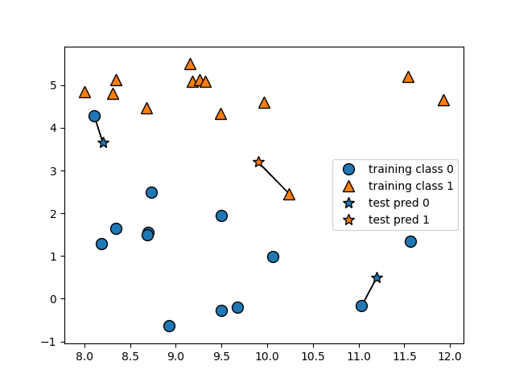
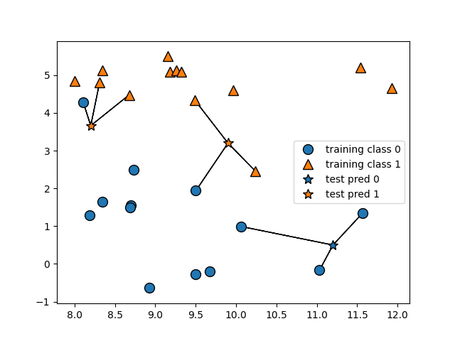

# K-Nearest Neighbors

- The k-NN algorithm is arguably the simplest machine learning algorithm. Building the model consists only of sorting the trainning dataset. To make a prediction for a new data point, the algorithm finds the closest data points in the trainning dataset-its "nearest Neighbors."

## K-Neighbors classification

In its simplest veersion, the k-NN algorithm only considers exactly one nearest Neighbor, wich is the closest trainning data point to the point we want to make a prediction for. The prediction is then simply the known output for this trainning point.

```python

mglearn.plots.plot_knn_classification(n_neighbors=1)

plt.savefig("forge_plot_k-nearest_neighbor.png")
plt.close()
```



- Here, we added three new data points, shown as stars. For each of them, we marked the closest point in the trainning set. The prediction of the one-nearest-neighbor algorithm is the label of that point (shown by the color of the cross).

- Instead of considering only the closet neighbor, we can also consider an arbitrary number, k, of neighbors. This is where the name of the k-nearest neighbors algorithm comes from.

  - when considering more than one neighbor, we use **voting** to assign a label. This means that for each test point, we caount how many neighbors belong to class 0 and how many neighbors belong to class 1. We then assign the class that is more frequent: in other words, the majority calss among the k-nearest neighbors.

```python

mglearn.plots.plot_knn_classification(n_neighbors=3)

plt.savefig("forge_plot_3-nearest_neighbor.png")
plt.close()
```



- Again, the prediction is shown as the color of the cross. You can see that the prediction for the new data point at the top left is not the same as the prediction when we used only one neighbor.

- While this illustration is for a binary classification problem, this method can be applied to datasets with any number of classes. For more classes, we count how many neighbors belong to each class and again predict the most common class.

- Now let’s look at how we can apply the k-nearest neighbors algorithm using scikit-learn. First, we split our data into a training and a test set so we can evaluate generalization performance, as discussed in Chapter 1.

```python
from sklearn.model_selection import train_test_split
X, y = mglearn.datasets.make_forge()

X_train, X_test, y_train, y_test = train_test_split(X, y, random_state=0)
```

- Next, we import and instantiate the class. This is when we can set parameters, like the number of neighbors to use. Here, we set it to 3:


```python
from sklearn.neighbors import KNeighborsClassifier
clf = KNeighborsClassifier(n_neighbors=3)
```

- Now, we fit the classifier using the training set. For KNeighborsClassifier this means storing the dataset, so we can compute neighbors during prediction


```python
clf.fit(X_train, y_train)
```

- To make predictions on the test data, we call the predict method. For each data point in the test set, this computes its nearest neighbors in the training set and finds the most common class among these:


```python
print("Test set predictions:", clf.predict(X_test))
```

[out]

```sh
Test set predictions: [1 0 1 0 1 0 0]
```

- To evaluate how well our model generalizes, we can call the score method with the test data together with the test labels:


```python

print("Test set acuracy: {:.2f}".format(clf.score(X_test, y_test)))
```

[out]

```sh
Test set accuracy: 0.86
```

- We see that our model is about 86% accurate, meaning the model predicted the class correctly for 86% of the samples in the test dataset.

#second_exercice 